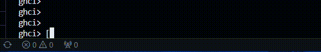
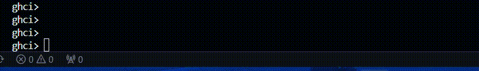
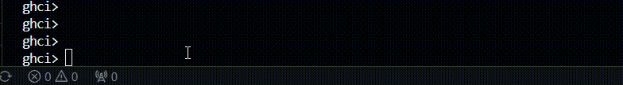

# List Comprehensions

A list comprehensions é um mecanismo que permite gerar e processar uma lista de elementos. Elas podem possuir parâmetros de filtragem e condição. O uso dessa
estrutura dispensa as funções de manipulação de listas como filter, map e laços de repetição.

### Estrutura

[x | x <- [1 .. 10], x > 10] -> [lista retorno | lista original, condições (opcionais)]

### Exemplos

[x + 2 * x + x / 2 | x <- [1, 2, 3, 4]]

[odd x | x <- [1..9]]

[(x,y) | x <- [1,3,5], y <- [2,4,6], x < y]

## Exercícios

1) Usando list comprehension, gere uma lista com os quadrados dos números de 1 a 10.
   Exemplo de saída esperada:
   [1,4,9,16,25,36,49,64,81,100]
   

2) Crie uma list comprehension que retorne todos os pares (x, y) em que x varia de 1 a 5 e y varia de 1 a 5, mas apenas quando x + y for par.
   Exemplo de saída esperada:
   [(1,1),(1,3),(1,5),(2,2),(2,4),(3,1),(3,3),(3,5),(4,2),(4,4),(5,1),(5,3),(5,5)]
   

3) Usando list comprehension, crie uma lista com todos os números primos entre 1 e 100.
   Exemplo de saída esperada (parcial):
   [2,3,5,7,11,13,17,19,23,29,31, ... , 97]
   

## List Comprehensions em outras linguagens

PowerShell

```powershell 
$s = ( 0..100 | ? {$_*$_ -gt 3} | % {2*$_} )
```

Python

```python
S = [2 * x for x in range(100) if x ** 2 > 3]
```

R

```r
x <- 0:100
S <- 2 * x[x ^ 2 > 3]
```

# Referências

- http://www.zvon.org/other/haskell/Outputsyntax/listQcomprehension_reference.html
- https://www.educative.io/answers/what-is-list-comprehension-in-haskell
- https://en.wikipedia.org/wiki/Comparison_of_programming_languages_(list_comprehension)
